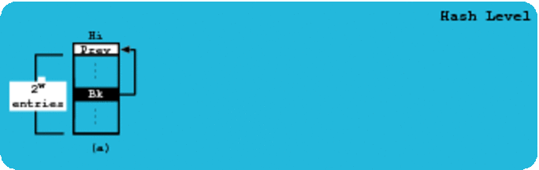

Lock-Free Fixed Persistent Hash Map (FFP)

The article "Towards a Lock-Free, Fixed Size and Persistent Hash Map
Design" available in https://doi.org/10.1109/SBAC-PAD.2017.26 has more
details about the FFP model.

Steps to compare Concurrent Hash Maps, Concurrent Skip Lists,
Non-Blocking Hash Maps, Concurrent Tries and FFP models in Linux:

1. git clone git@github.com:miar/ffp.git

2. cd ffp/benchSuite/

3. Open Makefile, update JDK_PATH and JDK with your system values,
close Makefile and do 'make' in the terminal

4. Results with execution times and memory used by each model will
appear in the 'tmp' directory

5. If you want to see how our model is implemented check the 'ffp'
directory.

Enjoy it.